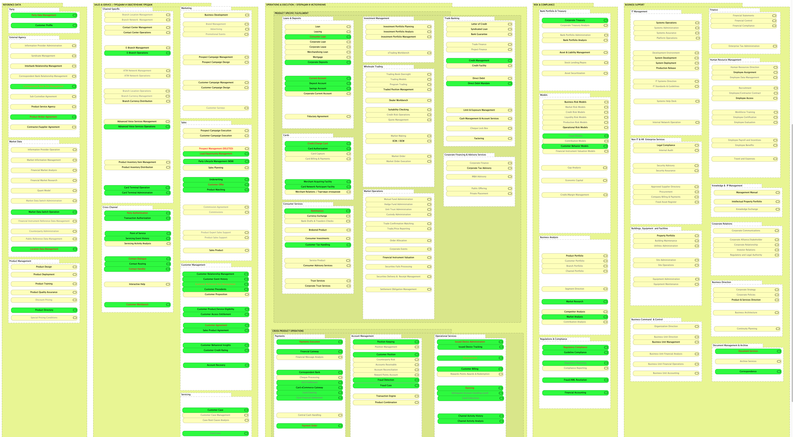
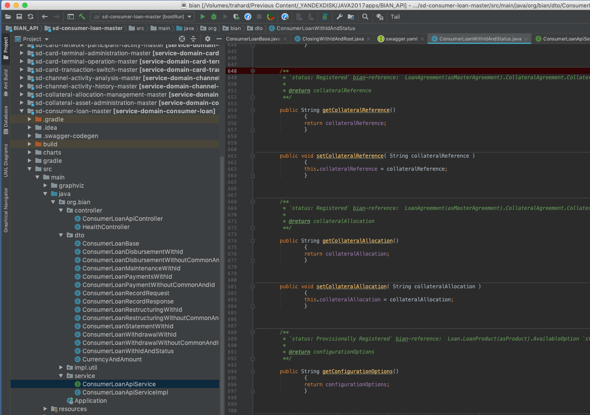
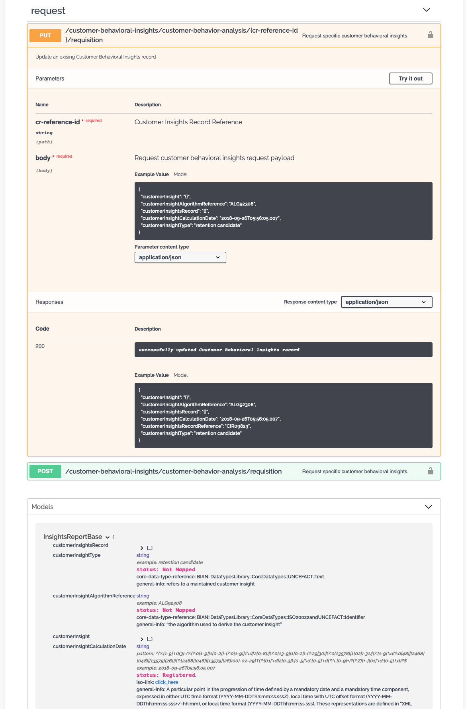

= BIAN

The Banking Industry Architecture Network e.V. (BIAN) SERVICE LANDSCAPE 7.0 in Archimate 3 model

You can open it in  https://www.archimatetool.com[ArchiTool]

https://arch.expert.life

This version includes all 304+ service domains completed (2000+ Service operations), a few business scenarios.

Model also avialable in
https://www.opengroup.org/open-group-archimate-model-exchange-file-format[Model Exchange File Format]
Yoy can import the file into most popular enterprise architecture tools, like  https://sparxsystems.com/enterprise_architect_user_guide/14.0/model_domains/imparchmeff.html[Sparx Enterprise Architect]

== A modern REST API that can serve as a starting point for your financial services.
It's great opportunity to use banking patterns in your micro service architecture.
88 out of 306 microservices are ready, marked green in the diagramm.
You can download Java source codes (#SPRING,#DOCKER) at https://portal.bian.org[BIAN portal]

== Service landscape example

image:BIAN%20service%20landscape%20demo.png["BIAN service landscape demo", link="BIAN%20service%20landscape%20demo.png"]

== Service operations example

image:BIAN%20one%20service%20operations%20example.png["BIAN one service operations example",link="BIAN%20one%20service%20operations%20example.png"]

== A few service domains example

image:BIAN%20relations%20between%20services%20example.png["BIAN relations between services example",link="BIAN%20relations%20between%20services%20example.png"]

== Architecture with JArchitect
image:https://www.jarchitect.com/assets/img/transparentlogo.png["JArchitecture",width=170,link="http://www.jarchitect.com"]
Architecture diagrams is also presented for comparison (coming soon!), built with JArchitect. Thanks to Codegears / CppDepend for the JArchitect.

== Architecture with Structure101
image:http://structure101.com/images/s101_170.png["Structure101",width=170,link="http://www.Structure101.com"]
Architecture diagrams is also presented for comparison (coming soon!), built with Structure101 Studio. Thanks to Structure101 for the Studio/Workspace.